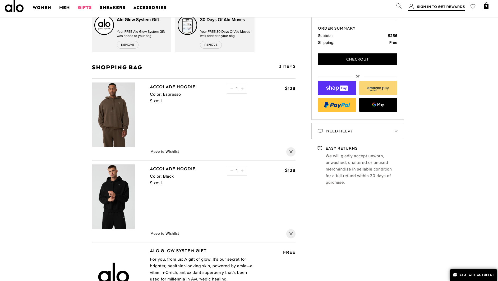
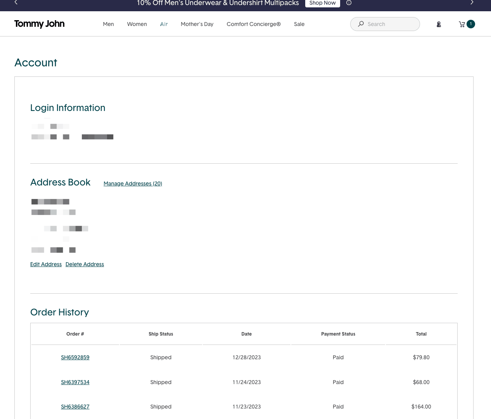

# Mock Store

Company Name: Bob's Super Spectacular Wonderful Amazing Store.

- [ ] Create a home page that features the 4 items on th page
- [ ] Create a PLP (Product List Page) page for Men's clothing
- [ ] Create a PDP (Product Detail) page from this page you should be able to have a working example of adding to the cart.
- [ ] Create a cart page [extra credit]
- [ ] Create a user account page [ extra credit]

there isn't a design for the the cart or user account page. use below as a reference for the two pages.

_Cart Page_

_User Account Page_

## Resources:

### _Design Files_

- Logo: [File](https://d.pr/i/ugdkaa)
- Sketch File: [File](https://www.sketch.com/s/567b2d62-1ed6-4914-a79d-caf4af030e5d)

You can find the assets for the store located in the section that says [Download Assets](https://d.pr/i/41q8sX).

### _Api_

[https://fakestoreapi.com/docs](https://fakestoreapi.com/docs "FakeStore Api")

### Vue

[https://www.storefrontui.io/](https://www.storefrontui.io/ "Storefront UI")
[https://storybook.storefrontui.io/?path=/story/introduction--how-to-use-storybook](https://storybook.storefrontui.io/?path=/story/introduction--how-to-use-storybook)

I was unable to find a free react component library. I feel between this one that I am sharing [here](https://mdbootstrap.com/docs/standard/templates/ecommerce/) and the storefront ui component library you should be able to tackle the plp and the pdp pages. If you have your own library yourself then feel free to use that as well.

### _Colors_

[https://coolors.co/2660a4-edf7f6-f19953-c47335-56351e](https://coolors.co/2660a4-edf7f6-f19953-c47335-56351e)

### _Two Collections_

Mens's clothing: [https://fakestoreapi.com/products/category/men's clothing](https://fakestoreapi.com/products/category/men%20clothing)
women's clothing: [https://fakestoreapi.com/products/category/women's clothing](https://fakestoreapi.com/products/category/women%20clothing)

Use the following user for the cart: [https://fakestoreapi.com/carts/user/2](https://fakestoreapi.com/carts/user/2)

User demographic: [https://fakestoreapi.com/users/2](https://fakestoreapi.com/users/2)

## Deployment

You don't need to worry about the deployment of the site. The site is connected to a vercel project. As soon as you push up to main it will deploy the the project url. You can view your store at the following url: [url](https://effie--mock-test-store.netlify.app "Mock Store")

## Additional Information

Feature the following items on the home page:
Mens: id: 2, 6
Womens: id 17, 19
